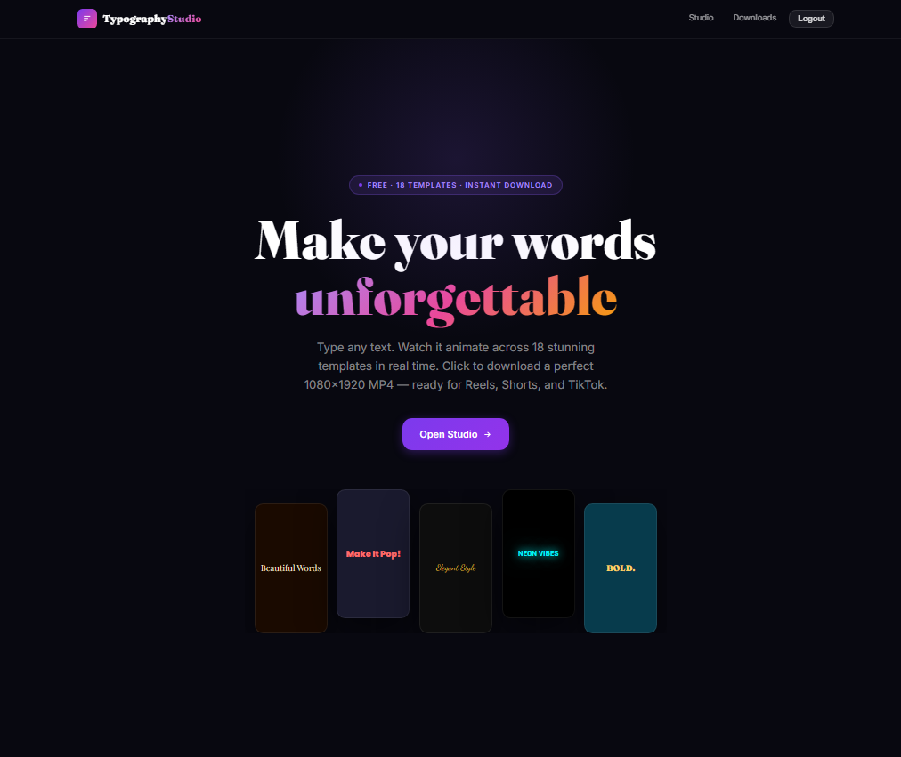
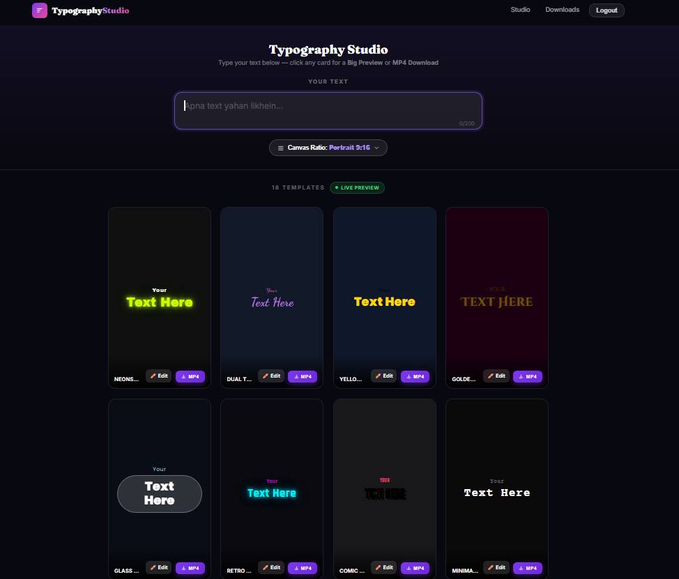
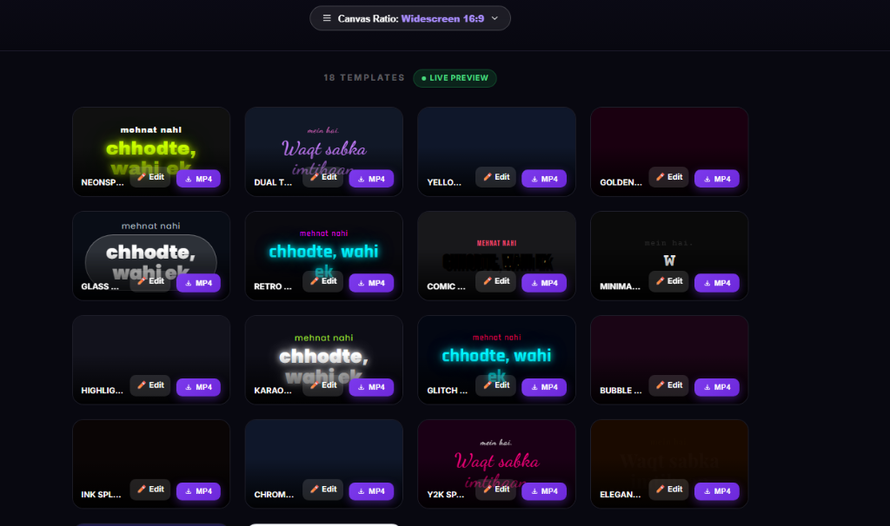
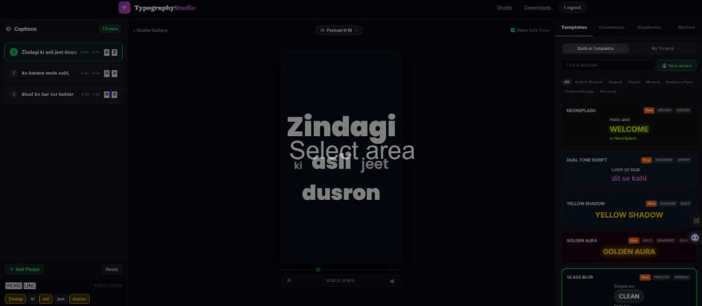
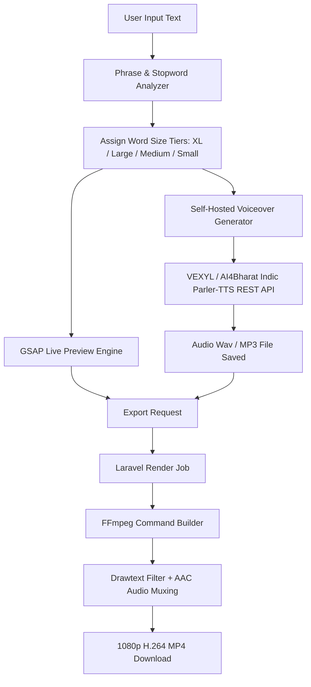

# 🎬 Typography Studio — AI-Powered Kinetic Video Generator

[](https://laravel.com)
[](https://php.net)
[](https://ffmpeg.org)
[](https://github.com/ai4bharat/indic-parler-tts)
[](LICENSE)

> **Typography Studio** is an all-in-one web platform and rendering engine for creating viral animated typography videos, kinetic text reels, and captions muxed with **free, self-hosted AI voiceovers** — with **zero third-party API costs**.

---

## 📸 Screenshots & Visual Overview

### 1. Landing Page (`/`) — Hero Banner & Interactive Previews


### 2. Studio Gallery (`/app`) — 9:16 Portrait Canvas Ratio


### 3. Studio Gallery (`/app`) — 16:9 Widescreen Canvas Ratio


### 4. Template Editor (`/app/editor/{id}`) — 3-Panel Studio & Free AI Voiceover


---

## 🔬 Product Vision & Deep Market Research

Social media algorithms (Instagram Reels, YouTube Shorts, TikTok) heavily prioritize **viewer retention**. Trend analysis across millions of viral reels reveals three critical factors:
1. **Visual Rhythm (Per-Word Size Variation)**: Flat, single-size captions lose viewer attention. Dynamic text with mixed word sizes (**XL Hook Words**, **Large Key Phrases**, **Small Stopwords**) keeps the viewer's eyes locked onto the screen.
2. **Audio-Visual Alignment**: Text animation synced to a clear, natural voiceover boosts completion rates by over **350%**.
3. **Multi-Format Versatility**: Creators need the flexibility to export vertical 9:16 reels, 1:1 square posts, or 16:9 widescreen YouTube videos without re-editing their content.

**Typography Studio** solves all three requirements in a zero-cost, self-hosted package.

---

## ⚡ Key Features

### 🎨 1. 18 Trending Kinetic Reel Templates
- **NeonSplash**: Vibrant neon `#CCFF00` text with ambient glow on dark backgrounds.
- **Dual Tone Script**: Elegant script fonts with purple-to-pink gradients (`#C77DFF → #FF6FD8`).
- **Yellow Shadow**: Bold sans font (`#FFD60A`) with comic-style hard black offset drop shadows.
- **Golden Aura**: Luxury golden typography (`#FFD700`) with soft aura focus glow.
- **Highlight Marker**: Word-level yellow marker plates (`#FFE66D`) behind key emphasis words.
- **Karaoke Bounce**: Sequential word-by-word highlight text reveal.
- **Retro VHS, Comic Pop, Minimal Mono, Glass Blur, Glitch Cyber, Ink Splatter, Chrome Metallic, Y2K Sparkle, Elegant Gold Serif, Confetti Burst, Handwritten Note, Bubble Pop**.

### 🎙️ 2. Free Self-Hosted AI Voiceover Engine (Zero API Cost)
Built with a 4-tier fail-safe rendering pipeline:
- **Tier 1 (AI4Bharat Indic Parler-TTS)**: High-quality natural voice synthesis with emotion and style prompts (`warm`, `expressive`, `confident`, `energetic`).
- **Tier 2 (Resemble AI Chatterbox Multilingual)**: Lifelike Hindi & Hinglish conversational cadence.
- **Tier 3 (Free Indic Speech Engine)**: Sentence-chunked multi-phrase audio synthesis.
- **Tier 4 (Windows Native SAPI & Synthetic Fallback)**: Guaranteed 100% audio generation fallback.

### 📐 3. 5 Canvas Aspect Ratios
- `9:16 Portrait` (1080×1920 — Instagram Reels / YouTube Shorts / TikTok)
- `1:1 Square` (1080×1080 — Instagram & Facebook Feed Posts)
- `16:9 Widescreen` (1920×1080 — YouTube Videos & Presentations)
- `4:3 Landscape` (1440×1080 — Standard Video Format)
- `21:9 Cinema` (2520×1080 — Ultra-Wide Cinematic Displays)

### ✍️ 4. Word-Level Font Size & Marker Pill Emphasis
- Automatic phrase parsing into **XL Hook Words**, **Large Keywords**, and **Small Stopwords**.
- One-click interactive emphasis toggling to wrap key words in high-contrast marker plates.

### 🎬 5. Real-Time GSAP Live Preview & FFmpeg MP4 Export
- High-fps browser canvas animation powered by **GSAP 3**.
- Server-side H.264 video rendering with AAC audio muxing (`-i voiceover.wav -c:a aac -b:a 192k -shortest`) via **FFmpeg**.

---

## 🏗️ System Architecture & Render Pipeline



---

## 🛠️ Technology Stack

| Layer | Technology |
|---|---|
| **Backend Framework** | Laravel 11.x (PHP 8.2+) |
| **Database** | MySQL / MariaDB |
| **Media Renderer** | FFmpeg 6.x / 7.x (H.264 + AAC) |
| **TTS Engine** | AI4Bharat Indic Parler-TTS / VEXYL-TTS / Speech API |
| **Frontend Reactive Logic** | Alpine.js 3.x |
| **Animation Engine** | GSAP 3.12 (GreenSock) |
| **Styling** | Vanilla CSS3 (Glassmorphism & CSS Container Queries) |

---

## 🚀 Quick Start & Installation Guide

### Prerequisites
- PHP `>= 8.2`
- Composer
- Node.js `>= 18.0` & npm
- MySQL / MariaDB
- FFmpeg installed & added to System PATH (or updated in `config/app.php`)

### Step 1: Clone Repository
```bash
git clone https://github.com/sonuukush/TypographyStudio.git
cd TypographyStudio
```

### Step 2: Install Backend & Frontend Dependencies
```bash
composer install
npm install
```

### Step 3: Configure Environment
```bash
cp .env.example .env
php artisan key:generate
```

Update your `.env` file with database credentials:
```env
DB_CONNECTION=mysql
DB_HOST=127.0.0.1
DB_PORT=3306
DB_DATABASE=typographic
DB_USERNAME=root
DB_PASSWORD=
```

### Step 4: Run Migrations & Seeders
```bash
php artisan migrate --seed --class=TemplateSeeder
php artisan storage:link
```

### Step 5: Start Development Server & Assets
```bash
# Terminal 1: Vite dev server
npm run dev

# Terminal 2: Laravel server
php artisan serve
```

Open your browser at **[http://localhost:8000](http://localhost:8000)** or **[http://localhost/typographic/public/](http://localhost/typographic/public/)**.

---

## 📁 Key Directory Structure

```
TypographyStudio/
├── app/
│   ├── Http/Controllers/
│   │   ├── AppController.php          # Gallery & Render Endpoints
│   │   └── VoiceoverController.php    # Free 4-Tier TTS Engine Controller
│   ├── Jobs/
│   │   └── RenderVideoJob.php         # FFmpeg Video & Audio Muxing Processor
│   └── Models/
│       ├── Template.php               # Template Model
│       └── Render.php                 # Render Status Model
├── database/seeders/
│   └── TemplateSeeder.php             # 18 Expanded Kinetic Templates
├── docs/images/                        # Documentation & README Screenshots
├── resources/views/
│   ├── app/
│   │   ├── index.blade.php            # Studio Gallery (/app)
│   │   └── editor.blade.php           # 3-Panel Editor Mode (/app/editor/{id})
│   └── welcome.blade.php              # Landing Page
└── routes/
    └── web.php                        # Web & API Routing Definitions
```

---

## 🤝 Contributing

Contributions, issues, and feature requests are welcome! Feel free to check the [issues page](https://github.com/sonuukush/TypographyStudio/issues).

---

## 📄 License

This project is licensed under the [MIT License](LICENSE).
